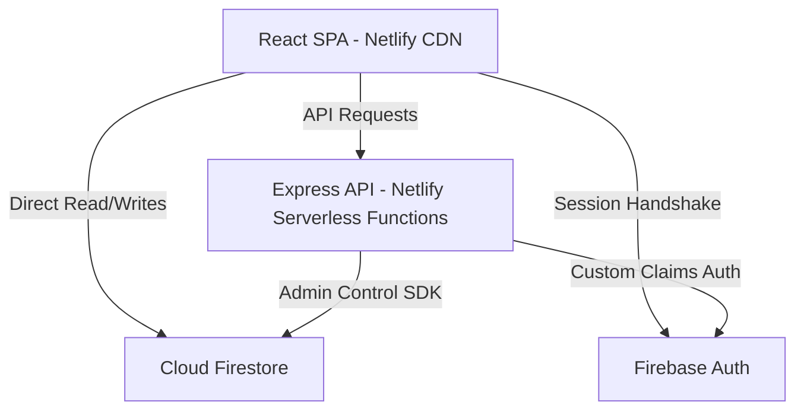

# System Architecture & Technical Specifications: MarkMe

## 1. System Overview
**MarkMe** is built using a modern decoupled full-stack architecture. The application layers consist of:
1.  **Frontend SPA:** A React 18 Single Page Application compiled with Vite.
2.  **Serverless Backend API:** An Express server wrapped using `serverless-http` to run as Netlify Functions.
3.  **Database & Authentication Layer:** Built on Google Cloud Firebase (Authentication & Cloud Firestore).



---

## 2. Frontend Architecture & Styling

### 2.1 SPA Framework & Routing
*   **Vite Dev Server:** Bundles frontend files using SWC for high-speed module compilation.
*   **React Router 6:** Configures single-page navigation inside `client/App.tsx`.
*   **App Layout wrapper:** An `AppLayout` component surrounds protected routes, ensuring navigation menus are rendered consistently based on user auth status.
*   **TanStack Query (React Query):** Manages caching and state synchronization for asynchronous data fetches.

### 2.2 Glassmorphism & Styling System
*   **TailwindCSS v3:** Tailed color palettes, translucent colors (`bg-background/80`, `bg-white/70`), and responsive grid layouts.
*   **Framer Motion:** Handles micro-animations, slide-ins, and spring transitions (e.g. event cards expanding, modal dialogs fading).
*   **Radix UI & Lucide Icons:** Lightweight pre-built primitives (Dialogs, Toasts, Tooltips) styled with custom Tailwind classes via the class merge utility `cn()`.
*   **Long-Polling Configuration:**
    Firestore client initialization is configured with `experimentalForceLongPolling: true` and `useFetchStreams: false`. This avoids WebRTC/WebSocket proxy disruptions and guarantees connectivity behind strict corporate/school network firewalls.

---

## 3. Serverless Backend & Routing

### 3.1 Netlify Integration
*   The Express application in `server/` compiles into individual scripts via a custom Vite server build config (`vite.config.server.ts`).
*   In production, Netlify routes traffic arriving at `/api/*` to the `api` handler inside the `netlify/functions/` directory, which boots the Express server instance on the fly using `serverless-http`.

### 3.2 Security Custom Claims Flow
*   **Custom Claims Authorization:** When an Admin registers or updates a user via `POST /api/admin/users`, the backend verifies if the user belongs to the Core Team with an admin title (Head or Executive).
*   If eligible, the server makes an asynchronous call to Firebase Admin Auth (`setCustomUserClaims(uid, { role: 'admin' })`).
*   **Frontend Synchronization:** When Custom Claims are updated on the server, a timestamp `claimsUpdatedAt` is written to the user's Firestore document. The client force-refreshes the ID token (`firebaseUser.getIdToken(true)`) to fetch the updated custom claims token.

---

## 4. Anti-Proxy Attendance Verification Logic

MarkMe uses a dynamic token check system to prevent attendees from taking a screenshot of a QR code and sending it to friends offsite:

```
[QR Code Screen]                        [Attendee Device]
Compute Unix Minute (M1)   ======>      Scan QR Code and extract M1
Generate payload:                       Check difference: |M1 - CurrentMinute|
"team|eventId|M1"                       If <= 1 minute, mark Attendance
                                        Else reject as Expired QR
```

### 4.1 Timestamp Token Hashing
*   **Minute Timestamp:** The code generators in `EventDetails.tsx` compute a timestamp using the Unix minute epoch:
    $$\text{unixMinute} = \lfloor \frac{\text{Date.now()}}{60000} \rfloor$$
*   **Payload Format:** `[type]|[eventId]|[unixMinute]` (e.g., `team|eX7yA9|29731840`).

### 4.2 Scanner Checking Mechanics
1.  **Scanning Window:** The checking script compares the scanned minute to the local device's current minute.
2.  **Tolerance Filter:**
    *   For **Team Members**, the scan is valid if:
        $$|\text{scannedMinute} - \text{currentMinute}| \le 1$$
        (Accepts scans from slightly asynchronous clocks).
    *   For **Guests**, the scan checks the code instantly. If it matches, the registration form is unlocked, allowing the guest to input their details without time pressure.
3.  **Re-entry protection:** The backend and firestore checks verify if the `uniqueId` has already checked-in for the requested `eventId`, rejecting duplicate entries.
