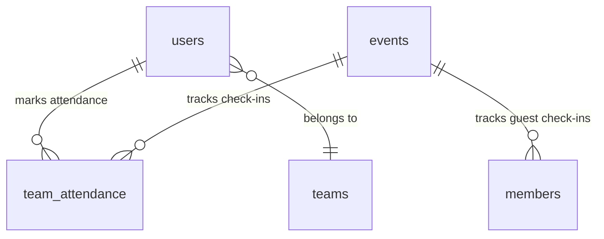

# Database Design & Schema: MarkMe

## 1. Cloud Firestore NoSQL Database Design

MarkMe uses Google Cloud Firestore in native mode. Since Firestore is a NoSQL document database, relationships are handled via references (e.g., storing user UIDs in arrays or matching document fields) and synchronized using Express backend controllers.

---

## 2. Collection Schemas

### 2.1 `users` Collection
Stores registered team members, volunteers, and administrative personnel. Each document key is the user's Firebase Authentication UID (`uid`).

| Field Name | Data Type | Description |
| :--- | :--- | :--- |
| `uid` | String | Firebase Auth unique user ID. |
| `name` | String | User's full name. |
| `email` | String / Null | User's personal email (or `<uniqueId>@attendance.local` alias). |
| `phone` | String / Null | User's contact number. |
| `className` | String / Null | Class representation (e.g. "B.Tech CSE"). |
| `rollNo` | String / Null | Registration roll number. |
| `year` | String / Null | Current college year (e.g. "3rd Year"). |
| `teamName` | String / Null | Name of the sub-team user is assigned to (e.g. "Tech Team"). |
| `position` | String / Null | Specific title (e.g. "Tech-Lead", "Co-Lead", "Member"). |
| `role` | String | Authorization role: `'admin'`, `'leader'`, or `'member'`. |
| `uniqueId` | String / Null | Alphanumeric system-assigned ID (e.g. `PA-B7C9D2`). |
| `claimsUpdatedAt` | Timestamp (ms) | Unix time of the last Firebase Custom Claims role sync. |
| `joinDate` | Timestamp (ms) | Unix time representation of when the profile was added. |
| `createdAt` | Timestamp (ms) | Profile creation timestamp. |

---

### 2.2 `teams` Collection
Stores organizational sub-teams. The document ID matches the team name (e.g. `Core team`).

| Field Name | Data Type | Description |
| :--- | :--- | :--- |
| `id` | String | Matches the team name (unique identifier). |
| `name` | String | Human-readable team name. |
| `members` | Array of Strings | Array containing the Firebase UIDs of users assigned to this team. |
| `createdAt` | Server Timestamp | Firestore server timestamp representing team creation time. |
| `updatedAt` | Timestamp (ms) | Unix timestamp of the last members array mutation. |

---

### 2.3 `events` Collection
Stores event details. Document IDs are auto-generated.

| Field Name | Data Type | Description |
| :--- | :--- | :--- |
| `id` | String | Match document key. |
| `title` | String | The event title. |
| `description`| String | Short paragraph description (max 200 words). |
| `date` | String | Date in `YYYY-MM-DD` format. |
| `startTime` | String | Start time in `HH:mm` format. |
| `endTime` | String | End time in `HH:mm` format. |
| `venue` | String | Physical venue location. |
| `status` | String | Computed status: `'Active'` or dynamic labels `'Live'`, `'Upcoming'`, `'Expired'`. |
| `createdAt` | Timestamp (ms) | Event creation Unix timestamp. |

---

### 2.4 `members` Collection
Stores external/guest attendee records who check-in using the Guest QR scanner form. Document IDs are auto-generated.

| Field Name | Data Type | Description |
| :--- | :--- | :--- |
| `eventId` | String | ID of the event checked-in for. |
| `name` | String | Attendee full name. |
| `class` | String | Class of the guest. |
| `year` | String | Academic year. |
| `rollNo` | String | Academic roll number. |
| `email` | String | Contact email address. |
| `entryDate` | String | ISO formatted local check-in date (`YYYY-MM-DD`). |
| `entryTime` | String | Local time of check-in string (e.g., `8:30:15 PM`). |

---

### 2.5 `team_attendance` Collection
Stores attendance check-ins for registered organization members scanning the Live Event Team QR. Document IDs are auto-generated.

| Field Name | Data Type | Description |
| :--- | :--- | :--- |
| `eventId` | String | ID of the event checked-in for. |
| `uniqueId` | String | User's system-assigned ID (e.g., `PA-F4H5J8`). |
| `name` | String | User's name. |
| `class` | String | User's class. |
| `rollNo` | String | User's roll number. |
| `teamName` | String | Sub-team affiliation. |
| `entryDate` | String | Check-in date (`YYYY-MM-DD`). |
| `entryTime` | String | Entry time stamp (e.g., `8:30:15 PM`). |

---

## 3. Relationships & Data Integrity Constraints

1.  **Direct Direct Lookup Constraint:** To avoid complex sub-collection querying, member attendance (`members`) and internal team attendance (`team_attendance`) are stored in flat root collections with an `eventId` property. 
2.  **Unique Entry Constraint:** Before marking attendance in `team_attendance`, the client scanner queries the collection where `eventId == scannedEventId` AND `uniqueId == userUniqueId` to prevent duplicate attendance logs.
3.  **Member-Team Alignment:** When an admin modifies a user's team Name (`teamName`), the user record is updated, and the server fetches all users registered under both the old and new teams to reconstruct the `members` UID array in the corresponding `teams` collection documents.
4.  **Orphan Cleanup:** The cleanup route `POST /api/admin/teams/clean-members` compares UIDs inside each team's `members` array against the IDs in the `users` collection, discarding records of deleted profiles.
